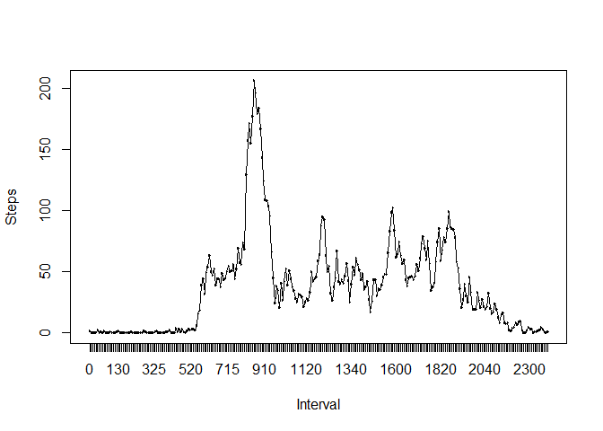

# Reproducible Research: Peer Assessment 1


## Loading and preprocessing the data
Reading data and transforming it for next steps using transfrom and group_by functions from the dplyr package

```r
library("dplyr")
```

```
## Warning: package 'dplyr' was built under R version 3.1.3
```

```
## 
## Attaching package: 'dplyr'
## 
## The following objects are masked from 'package:stats':
## 
##     filter, lag
## 
## The following objects are masked from 'package:base':
## 
##     intersect, setdiff, setequal, union
```

```r
data <- read.csv("activity.csv")
dataA <- transform(data,date = factor(data$date))
dataB <- group_by(dataA,date)
dataC <- transform(data,interval = factor(data$interval))
dataD <- group_by(dataC,interval)
```


## What is mean total number of steps taken per day?
Plotting the histogram and calculating mean and median for all days

```r
hist_sum <- summarize(dataB,steps = sum(steps,na.rm=TRUE))
library("ggplot2")
```

```
## Warning: package 'ggplot2' was built under R version 3.1.3
```

```r
ggplot(hist_sum,aes(x=date,y=steps)) + geom_bar(stat="identity") + theme(axis.text.x = element_text(angle = 90, hjust = 1))
```

 

```r
mean(hist_sum$steps,na.rm=TRUE)
```

```
## [1] 9354.23
```

```r
quantile(hist_sum$steps,probs=c(0.5),na.rm=TRUE)
```

```
##   50% 
## 10395
```
## What is the average daily activity pattern?
Creating a timeseries chart and retriving the value of the interval with maximum number of average steps

```r
time_series <- summarize(dataD,steps = mean(steps,na.rm=TRUE))
plot(time_series$interval,time_series$steps,xlab="Interval",ylab="Steps")
lines(time_series$interval,time_series$steps,type="l")
```

 

```r
time_series$interval[which(time_series$steps == max(time_series$steps))]
```

```
## [1] 835
## 288 Levels: 0 5 10 15 20 25 30 35 40 45 50 55 100 105 110 115 120 ... 2355
```

## Imputing missing values

```r
sum(is.na(data))
```

```
## [1] 2304
```

```r
newData <- data
newData$steps[which(is.na(newData))] <- time_series$steps[which(newData$interval[which(is.na(newData))]==time_series$interval)]

newData$steps[which(is.na(newData))] <- quantile(hist_sum$steps[which(newData$date[which(is.na(newData))]==hist_sum$date)],probs=c(0.5),na.rm=TRUE)
```

```
## Warning in is.na(e1) | is.na(e2): longer object length is not a multiple of
## shorter object length
```

```
## Warning in `==.default`(newData$date[which(is.na(newData))], hist_sum
## $date): longer object length is not a multiple of shorter object length
```

```r
sum(is.na(newData))
```

```
## [1] 0
```

```r
newDataA <- transform(newData,date = factor(newData$date))
newDataB <- group_by(newDataA,date)
new_hist_sum <- summarize(newDataB,steps = sum(steps,na.rm=TRUE))
ggplot(new_hist_sum,aes(x=date,y=steps)) + geom_bar(stat="identity") + theme(axis.text.x = element_text(angle = 90, hjust = 1))
```

 

```r
mean(new_hist_sum$steps,na.rm=TRUE)
```

```
## [1] 9530.724
```

```r
quantile(new_hist_sum$steps,probs=c(0.5),na.rm=TRUE)
```

```
##   50% 
## 10439
```

## Are there differences in activity patterns between weekdays and weekends?

```r
days <- c("Monday","Tuesday","Wednesday","Thursday","Friday")
dataE <- transform(newData,newDate = factor(weekdays(strptime(newData$date,"%Y-%m-%d")) %in% days,labels=c("Weekday","Weekend")))
dateF <- group_by(dataE,newDate)
ggplot(data = dateF,aes(x=interval,y=steps,group=1)) + geom_line() + facet_grid(newDate~.)
```

 
